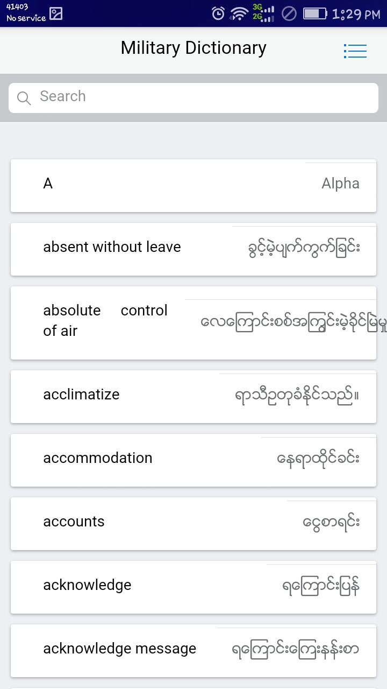
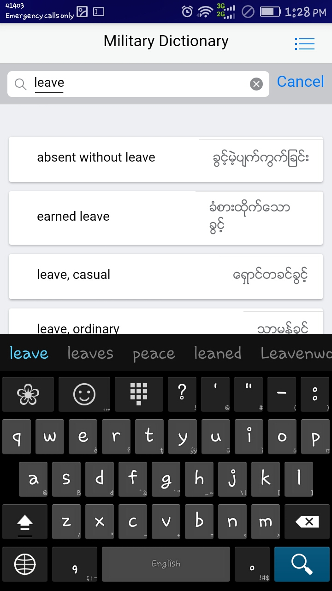
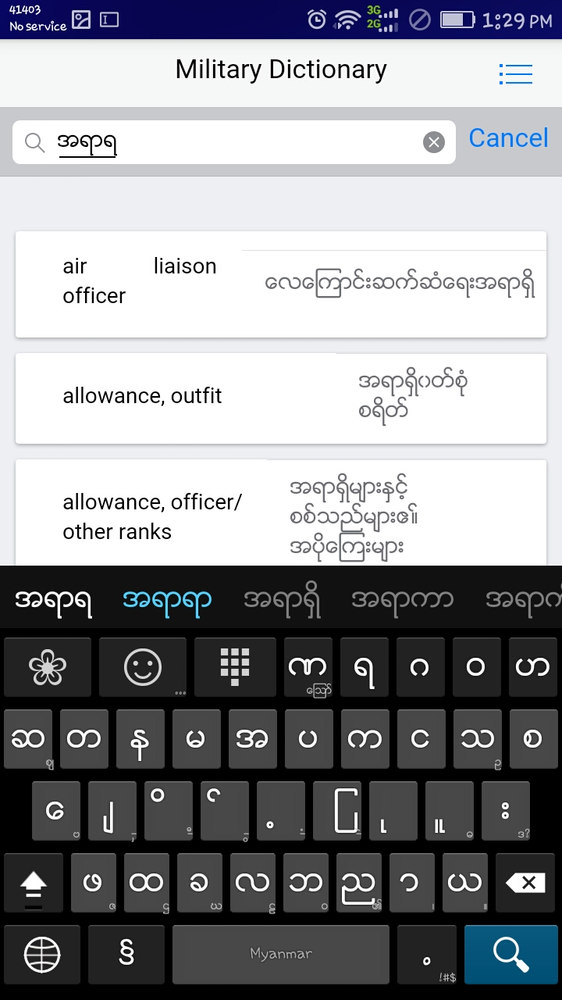
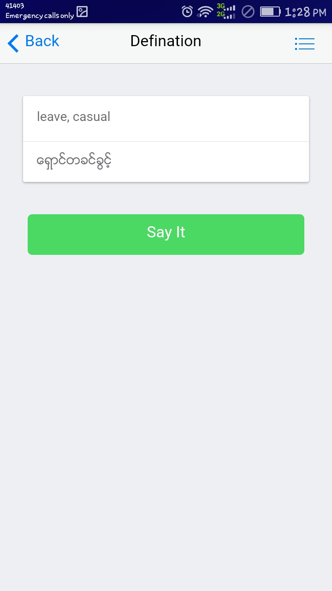

# Myanmar - English Military Dictionary ( Dataset in CSV )

The application is developed by [TEAM CS 16!](https://facebook.com/teamcs1111)

## Data Set
The dictionary data set used in this application  is hosted in [Myanmar Military Dictionary Data Set](https://github.com/aungkoman/military_dictionary_dataset)

## Download
The Android Application  can be downloaded at  [Myanmar Military Dictionary!](http://www.mediafire.com/file/qe33k8v4hek3q0o/%25E1%2580%2585%25E1%2580%2585%25E1%2580%25B9%25E1%2580%259E%25E1%2580%25B6%25E1%2580%25AF%25E1%2580%25B8%25E1%2580%25B0_%25E1%2580%25A1%25E1%2580%2598%25E1%2580%25AD%25E1%2580%2593%25E1%2580%25AC%25E1%2580%2594%25E1%2580%25B9.apk/file)

## Application Screenshot

## Application Screenshot

## Application Screenshot

## Application Screenshot
